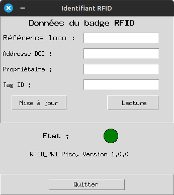

# Graphic interface for the RFID_RPi application

This application is to be used with the [RFID_RPi application](https://github.com/jrijri/RFID_RPI), it provides a graphical and user friendly interface to read and write RFID tags.

## Frame of the interface

Note: so far this interface is in Franch language, but it can easily be changed in the code.

## GUI motor

This application requiers the use of pygubu library, you can add it to your environment using [Pypi](https://pypi.org/project/pygubu/).

## How to use this application in 5 steps

1. Connect the RPi Pico to the USB interface, check this is seen as /dev/ttyACM0. If not, change the hard coded value in line 54 of main.py file.
2. Run the application to get the GUI displayed on your screen. You shall see the status message RFID_RPi Pico, Version x.x.x3 If not check the connection and the USB interface as mentioned on point #1.
3. Place a tag close to the card and press the "Lecture" (Read) Button, the greeen light turns to orange while running and back to green if this is a success or red if there is a problem. If no card is close to the reader, the tag value is "-1", otherwise, this value is different.
4. Change the fields values as you wish and press the ""Mise à jour" (write) button keeping the tag close to the reader. Again, the light turns orange during the transaction with the tag and is back to green when done.
5. Check the new values have been saved thanks to the step #3.

## Versions
   + 1.0.0: 2024-01-09. Initial version running the READ, WRITE and CHECK functions.

## What next?

This interface can be mimicked and integrated in JMRI for one automated add of a new engine when placed close to the reader.
